# Buffers and Voltage Controlled Buffers 
There are three folders containing three vivado projects.  In this lab and all other labs, you will be asked to demonstrate each circuit to an instructor, answer the questions (look up the answer online or make a hypothesis). Suggest you edit this readme file. 

## Buffers

#### Port Diagram

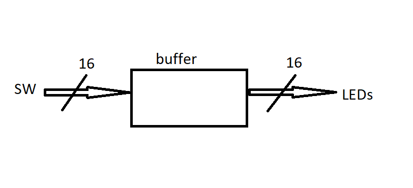

#### Verilog Code

module switchLED(
    input [15:0] SW,
    output [15:0] LED
    );
    assign LED = SW;
endmodule

#### RTL Schematic Screen shot

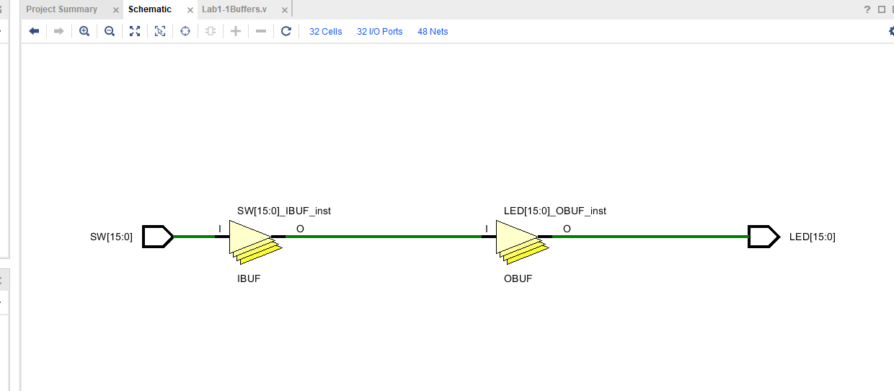

#### Synthesis Schematic Screen shot

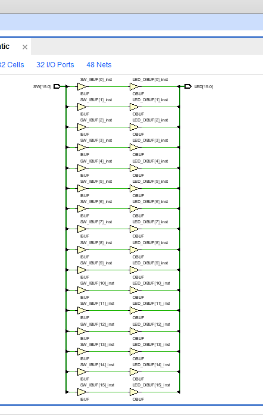

#### Implementation Device screen shot zoomed in on something interesting

#### Testing

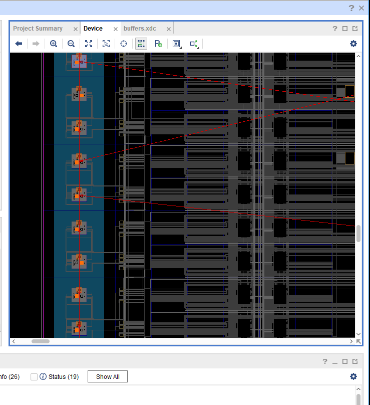

*What is a net?*    a collection of wires, a bundle of wires. 
*What is a cell?*  a cell is an input.
*What is an IO port?*  IO port is an input output device 

*What do the yellow triangles labeled OBUF do?* an output buffer that increases voltage on the output path to the LED 
*What physically is a zero?*  physical zero is generally considered a ZERO voltage but can also be voltage that is below the threshold of actuation for a electronic devise.
*What logically is a zero?*  logical zero is; an open switch or a wire without voltage.
*What physically is a one?*  physical one is voltage being carried down a wire, a closed switch.
*What logically is a one?*  a logical one is  a closed switch or a wire with voltage. 

## MultipleLEDs  
#### Port Diagram

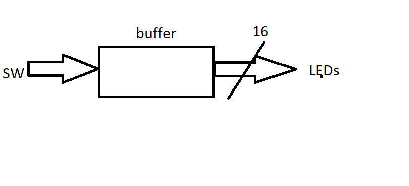

#### Verilog Code

module switchLED(
    input SW,
    output [15:0] LED
    );
    assign LED[0] = SW;
    assign LED[1] = SW;
    assign LED[2] = SW;
    assign LED[3] = SW;
    assign LED[4] = SW;
    assign LED[5] = SW;
    assign LED[6] = SW;
    assign LED[7] = SW;
    assign LED[8] = SW;
    assign LED[9] = SW;
    assign LED[10] = SW;
    assign LED[11] = SW;
    assign LED[12] = SW;
    assign LED[13] = SW;
    assign LED[14] = SW;
    assign LED[15] = SW;

endmodule

#### RTL Schematic Screen shot

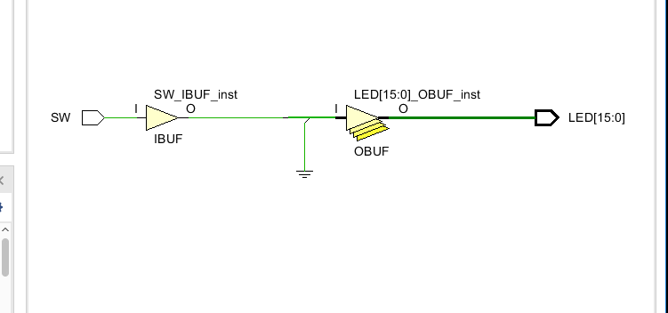

#### Synthesis Schematic Screen shot

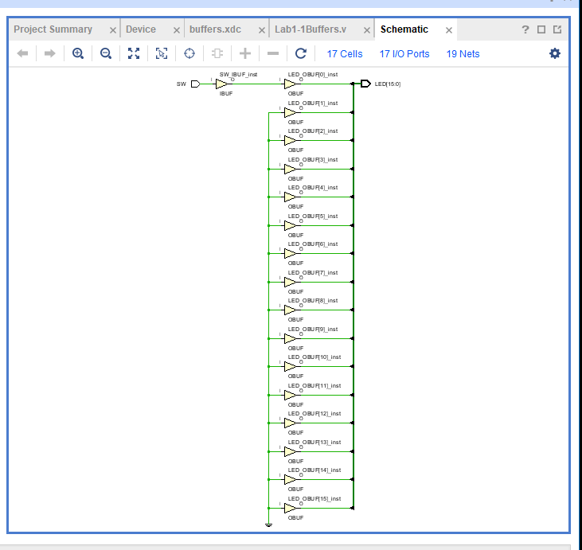

#### Implementation Device screen shot zoomed in on something interesting

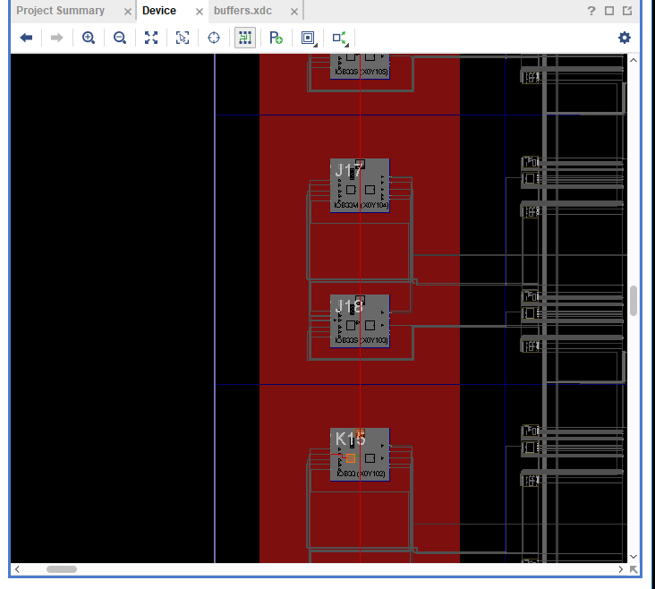

#### Testing

Look at the verilog code and the constraints file.  
Make modifications so that one switch drives mutliple LED's.  
*How many LED's can one switch drive?*  16, can probably do ALL LEDs on the board. 

*If vivado fails, where does it fail (RTL. Synthesis, Implementation or Bit File Generation), what is the error message?  What does the error message mean in your own words?*

*Instead of 16 lines of verilog code, everything can be put in one line. What is this one line?* assign LED[15:0] = SW;

## MultipleSwitches

This project or circuit fails. Two switches can not drive one LED.  Take screen shots until you reach an error message: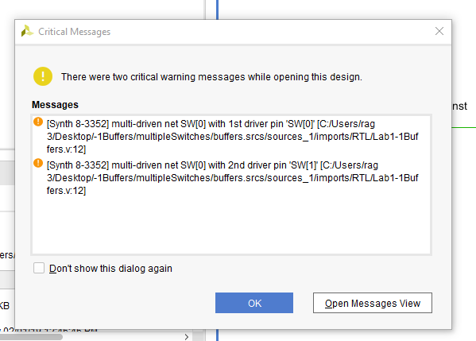

[Synth 8-3352] multi-driven net LED_OBUF with 2nd driver pin 'SW_IBUF[1]_inst/O' ["C:/Users/rag 3/Desktop/-1Buffers/multipleSwitches/buffers.srcs/sources_1/imports/RTL/Lab1-1Buffers.v":12]

#### Port Diagram

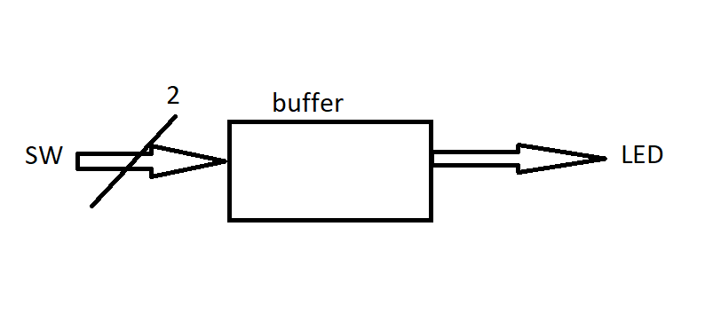

#### Verilog Code

module switchLED(
    input [2:0] SW,
    output LED
    );
    assign LED = SW[0];    
    assign LED = SW[1];
    
endmodule

#### RTL Schematic Screen shot

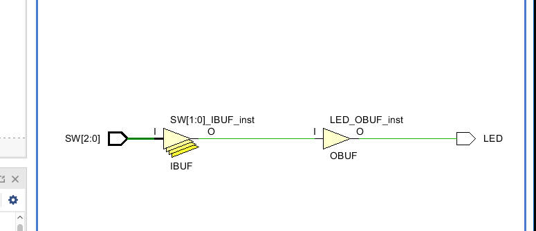

#### Synthesis Schematic Screen shot

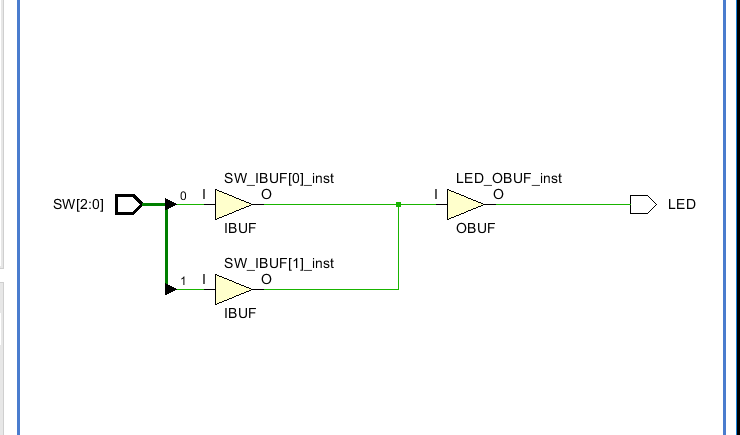

#### Implementation Device screen shot zoomed in on something interesting

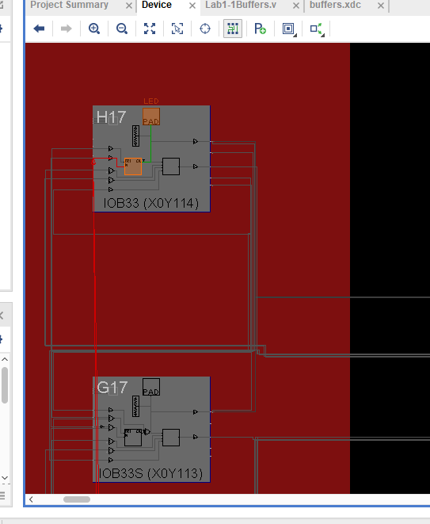

#### Testing

*What are the vivado error messages?  Guess what each means in your own words.*

 [Synth 8-3352] multi-driven net SW[0] with 1st driver pin 'SW[0]' ["C:/Users/rag 3/Desktop/-1Buffers/multipleSwitches/buffers.srcs/sources_1/imports/RTL/Lab1-1Buffers.v":12]

multiple external wires/switches are trying to control two internal buffers.

[Synth 8-3352] multi-driven net LED_OBUF with 2nd driver pin 'SW_IBUF[1]_inst/O' ["C:/Users/rag 3/Desktop/-1Buffers/multipleSwitches/buffers.srcs/sources_1/imports/RTL/Lab1-1Buffers.v":12]

one LED is trying to be controlled by multiple switches.

*How do the net, cell, IO ports change?* 

nothing obvious, RTL schematics look the same to earlier, successful RTL schematics.

*Does vivado fail during RTL Analysis, Synthesis, Implementation or Bit File Generation?* 

critical warnings (orange) on RTL, Synthesis....

error message (red) on Implementation 

[Vivado_Tcl 4-78] Error(s) found during DRC. Opt_design not run.

*What does the error message multi-driven net mean? What would you look for as an error in your circuit design? What is a multi-driven net?*

would look for error/warning messages in the 'message' section of vivado (if no pop up windows self deploy)

multi-driven net should be a wire that has multiple independent inputs placed on that wire; vivado does not like parallel circuits(?).

****

## BeCreative!

Hook the switches to the LED's in some creative way of your choice using the concepts you learned in this lab.

#### Port Diagram

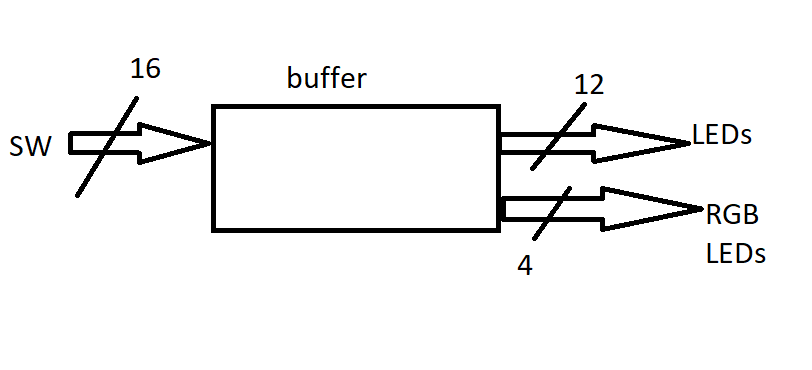

#### Verilog Code

module switchLED(
    input [15:0] SW,
    output [15:0] LED
    );
    assign LED[0] = SW[0];
    assign LED[1] = SW[1];
    assign LED[2] = SW[2];
    assign LED[3] = SW[3];
    assign LED[4] = SW[4];
    assign LED[5] = SW[5];
    assign LED[6] = SW[6];
    assign LED[7] = SW[7];
    assign LED[8] = SW[8];
    assign LED[9] = SW[9];
    assign LED[10] = SW[10];
    assign LED[11] = SW[11];
    assign LED[12] = SW[12]; // led16_b
    assign LED[13] = SW[13]; // led16_g
    assign LED[14] = SW[14]; // led16_r
    assign LED[15] = SW[15]; // led17_b

endmodule

#### RTL Schematic Screen shot

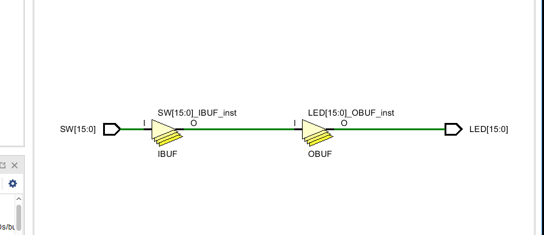

#### Synthesis Schematic Screen shot

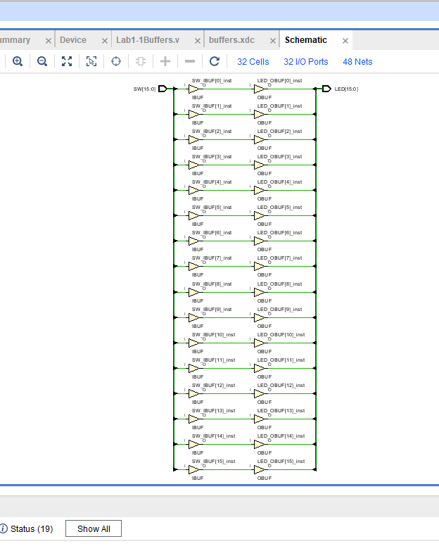

#### Implementation Device screen shot zoomed in on something interesting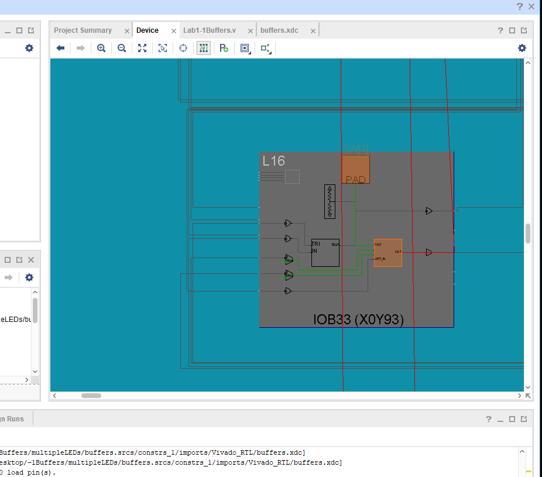

#### Testing

passed testing;

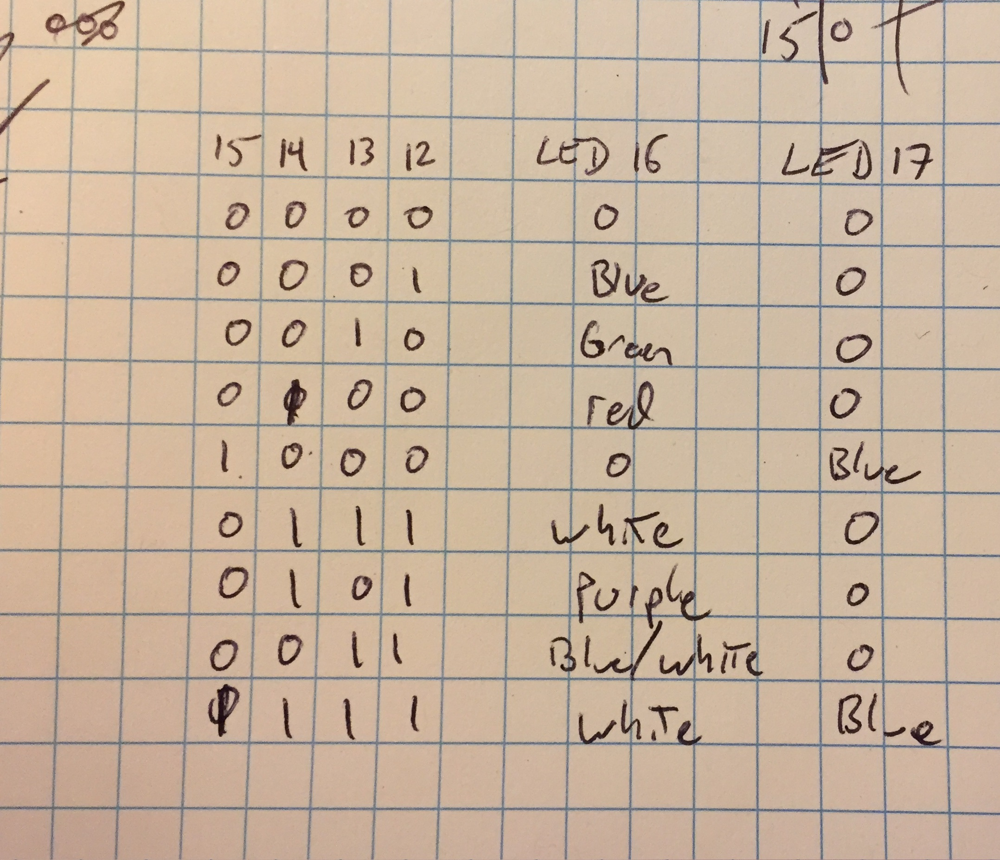